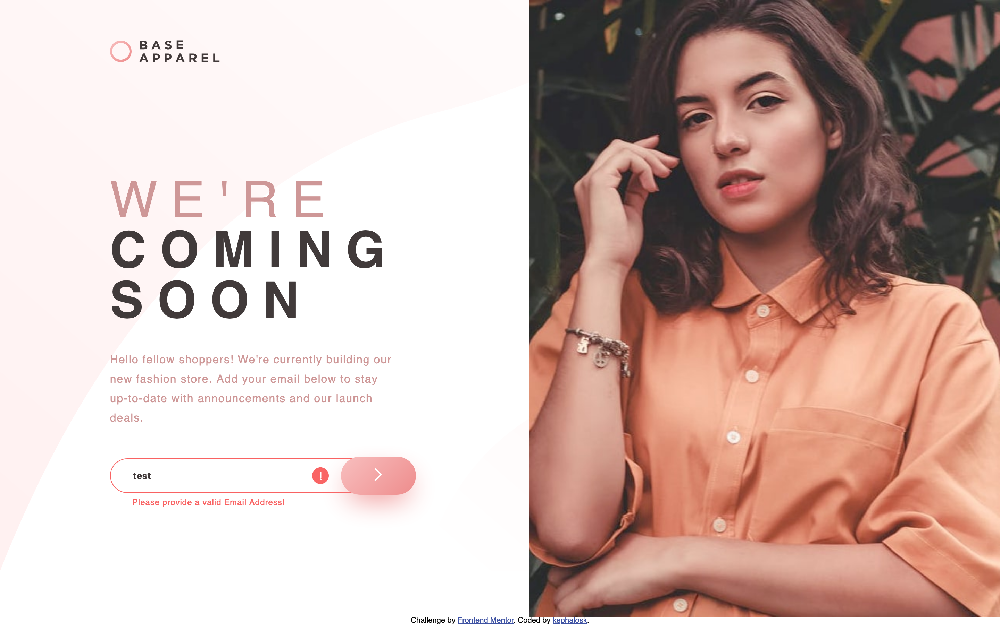
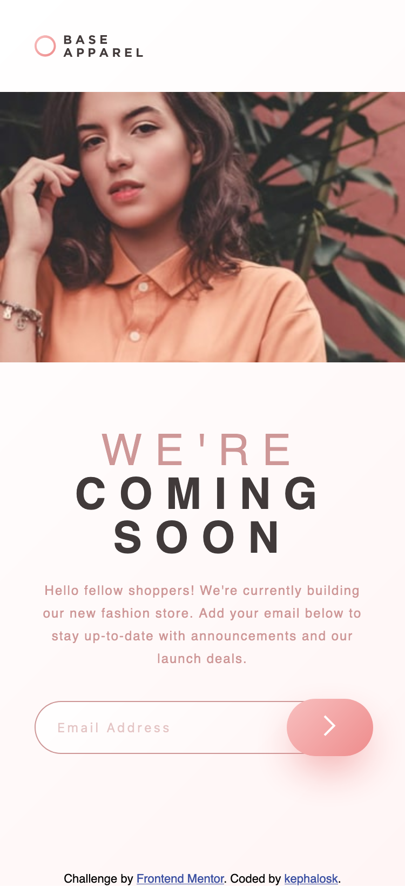
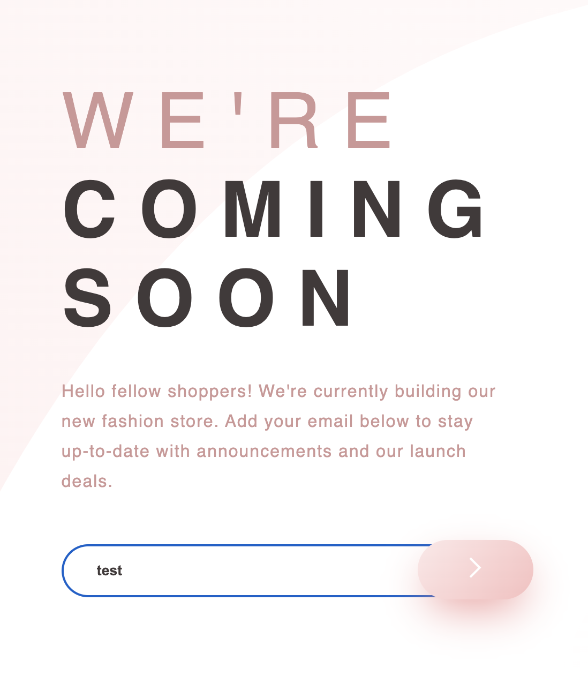

# Frontend Mentor - Social links profile solution

This is a solution to the [Blog preview card challenge on Frontend Mentor](https://www.frontendmentor.io/challenges/blog-preview-card-ckPaj01IcS/hub). Frontend Mentor challenges help you improve your coding skills by building realistic projects. 

## Table of contents

- [Overview](#overview)
  - [Screenshot](#screenshot)
  - [Links](#links)
- [My process](#my-process)
  - [Built with](#built-with)
  - [What I learned](#what-i-learned)
  - [Continued development](#continued-development)
  - [Useful resources](#useful-resources)
- [Author](#author)
- [Acknowledgments](#acknowledgments)


## Overview

### Screenshot

Desktop


Desktop Error


Mobile


Active


### Links

- Solution URL: [Add solution URL here](https://github.com/kephalosk/base-apparel-coming-soon)
- Live Site URL: [Add live site URL here](https://kephalosk.github.io/base-apparel-coming-soon/)

## My process

1. download Project


2. move Project to target folder


3. open Project in IDE


4. read README


5. add .gitignore-file


6. check files


7. check design


8. initialize repo
* create repo on GitHub
* git init
* git add .
* git commit -m "initial commit"
* git remote add origin git@github.com:kephalosk/${projectname}.git
* git push -u origin master

9. check html
* build general structure
* open index.html in browser for comparison

10. check css
* image styling
* font styling
* color styling
* frame styling
* spacing styling

11. check transitions


12. check javascript


13. check mobile/responsive design


14. check accessability
* semantic html
* headings
* alternative texts
* language
* clear language
* link texts

15. extract css


16. add screenshots


17. update README


18. publish website

### Built with

- Semantic HTML5 markup
- CSS custom properties
- Desktop-first workflow

### What I learned

I learned to align absolut overlays to their relative html element
```css
.contentEmail {
  align-items: center;
  display: flex;
  position: relative;
  width: 100%;
}

.contentEmailIcon {
  display: none;
  left: 70%;
  position: absolute;
  top: calc(50%);
  transform: translateY(-50%);

  @media (min-width: 711px) and (max-width: 840px) {
    left: 60%;
  }

  @media (min-width: 601px) and (max-width: 710px) {
    left: 59%;
  }

  @media (max-width: 600px) {
    left: 64%;
  }
}

button {
  background-image: linear-gradient(135deg, hsl(0, 80%, 86%), hsl(0, 74%, 74%));
  border: 0;
  border-radius: 50px;
  box-shadow: 0 16px 40px -10px hsl(0, 74%, 74%);
  left: 80%;
  padding: 16px 48px;
  position: absolute;
  top: calc(50%);
  transform: translateY(-50%);

  @media (min-width: 711px) and (max-width: 840px) {
    left: 70%;
    padding: 14px 38px;
  }

  @media (min-width: 601px) and (max-width: 710px) {
    left: 70%;
    padding: 12px 36px;
  }

  @media (max-width: 600px) {
    left: 75%;
    padding: 15px 34px;
  }
}
```

I learned to validate an email with an regex
```javascript
    function isValidEmail(email) {
  const emailRegex = /^[^\s@]+@[^\s@]+\.[^\s@]+$/;
  return emailRegex.test(email);
}
```

I learned style and use input fields:
```css
input {
  border: 1px solid hsl(0, 36%, 70%);
  border-radius: 50px;
  color: hsl(0, 6%, 24%);
  font-weight: bold;
  padding: 16px 16px 16px 32px;
  width: 80%;

  @media (min-width: 601px) and (max-width: 710px) {
    font-size: 12px;
    padding: 12px 12px 12px 24px;
  }

  @media (max-width: 600px) {
    background-image: linear-gradient(135deg, hsl(0, 0%, 100%), hsl(0, 100%, 98%));
    font-size: 12px;
    font-weight: normal;
    padding: 16px 16px 16px 20px;
  }
}

input.error {
  border: 1px solid hsl(0, 93%, 68%);
}

input::placeholder {
  color: hsl(0, 36%, 70%);
  letter-spacing: 2px;
}
```

I improved html, css and javascript skills in general.

### Continued development

* improve html
* improve css

### Useful resources

- [w3schools](https://www.w3schools.com/) - HTML and CSS knowledge
- [selfhtml](https://wiki.selfhtml.org/wiki/HTML) - HTML knowledge

## Author

- Website - [kephalosk](https://easywebpath.com)
- Frontend Mentor - [@yourusername](https://www.frontendmentor.io/profile/yourusername)
- Twitter - [@yourusername](https://www.twitter.com/yourusername)

## Acknowledgments

None.